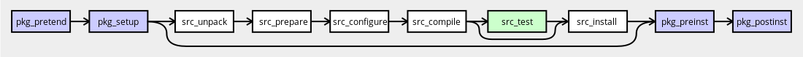

# Ebuild 阶段函数

从源安装软件包时，函数调用顺序为 `pkg_pretend`，`pkg_setup`，`src_unpack`，`src_prepare`，`src_configure`，`src_compile`，`src_test`（可选，`FEATURES ="test"`），`src_install`，`pkg_preinst`，`pkg_postinst`。从二进制文件安装软件包时，函数调用顺序为 `pkg_pretend`，`pkg_setup`，`pkg_preinst`，`pkg_postinst`。由于尚未从一开始就引入某些阶段，因此您可以查看[EAPI 使用和描述](./../eapi-usage-and-description.md)以获取概述，其中介绍了在哪个 EAPI 中引入了哪些内容。

`pkg_pretend` 函数将用于执行各种早期的完整性检查，例如确保启用了某些内核选项。重要的是要记住，`pkg_pretend` 与其余阶段功能序列分开运行。因此，没有节省环境或传播到下一阶段。此外，在此阶段不能保证满足 ebuild 依赖关系。

卸载软件包时，将调用 `pkg_prerm` 和 `pkg_postrm` 函数。 `pkg_config` 函数用于任何特殊的软件包配置——仅在用户明确请求时运行。当 `RESTRICT ="fetch"`包需要获取某些 `SRC_URI` 组件时，将使用 `pkg_nofetch` 函数。

在从 `pkg_preinst` 到 `pkg_postinst` 的过渡之间，文件从 沙盒 临时安装位置复制到活动文件系统，并且 Portage 记录已安装文件的摘要。

在测试或调试时，可以使用 ebuild 命令指示 Portage 从 `ebuild` 执行特定功能，有关更多信息，请参见 `ebuild(1)`手册页。

下载软件包的源代码是在上述任何一个阶段之前进行的，因此，`emerge --fetchonly` 应该执行您需要的所有网络访问（除非您正在使用实时 ebuild）。超出此范围的网络访问将不会在本地缓存（例如，在`${DISTDIR}`中，请参阅[预定义的只读变量](./../variables.md)），这使得很难生成可复制的内部版本（请参见 [VCS Sources 的缺点](./src_unpack/version-control-system-sources.md)）。通过使用本地文件，扩展 `SRC_URI`（请参阅 [Ebuild 定义变量](./../variables.md)）等，避免在任何阶段进行网络访问。

## 默认阶段函数是：

缺省`pkg_nofetch`和`src_*`阶段函数可通过名称以`default_`开头并以相应阶段函数名结尾的函数访问。例如，对名称为`default_src_compile`的函数的调用等效于对默认`src_compile`实现的调用。

默认阶段函数：

- `default_pkg_nofetch`
- `default_src_unpack`
- `default_src_prepare`
- `default_src_configure`
- `default_src_compile`
- `default_src_test`
- `default_src_install`

在上述每个阶段都重新定义了一个名为`default`的函数，因此它将调用与当前阶段相对应的`default_*`函数。例如，在`src_compile`阶段对默认函数的调用等效于对`default_src_compile`函数的调用。

## 内容

- [pkg_pretend](./pkg_pretend.md)
- [pkg_nofetch](./pkg_nofetch.md)
- [pkg_setup](./pkg_setup.md)
- [src_unpack](./src_unpack/README.md)
  - [版本控制系统（VCS）源](./src_unpack/version-control-system-sources.md)
  - [RPM 来源](./src_unpack/rpm-sources.md)
  - [其他压缩格式](./src_unpack/other-archive-formats.md)
- [src_prepare](./src_prepare/README.md)
  - [使用 epatch 和 eapply 修补](./src_prepare/patching-with-epatch-and-eapply.md)
  - [自动打包](./src_prepare/autopackage.md)
- [src_configure](./src_configure/README.md)
  - [配置软件包](./src_configure/configuring-a-package.md)
- [src_compile](./src_compile/README.md)
  - [配置构建环境](./src_compile/configuring-build-environment.md)
  - [建立一个软件包](./src_compile/building-a-package.md)
  - [没有构建系统](./src_compile/no-build-system.md)
- [src_test](./src_test.md)
- [src_install](./src_install/README.md)
  - [可控压缩](./src_install/controllable-compression.md)
- [pkg_preinst](./pkg_preinst.md)
- [pkg_postinst](./pkg_postinst.md)
- [pkg_prerm](./pkg_prerm.md)
- [pkg_postrm](./pkg_postrm.md)
- [pkg_config](./pkg_config.md)
- [pkg_info](./pkg_info.md)
