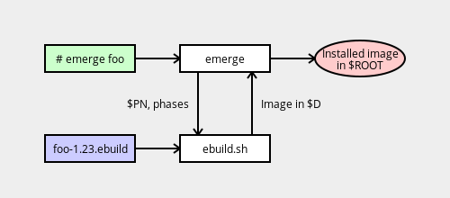

# Emerge 和 Ebuild 关系

`emerge`程序是`ebuild.sh`的高级包装，它处理依赖项跟踪、安全安装和卸载等。在构建过程中，`emerge`会调用`ebuild.sh`，后者依次处理 ebuild 文件和所有 eclass。从`${D}`到`${ROOT}`的安装由`emerge`处理。

<b>代办事项</b>：<a href="https://dev.gentoo.org/~g2boojum/portage.html">https://dev.gentoo.org/~g2boojum/portage.html</a>

