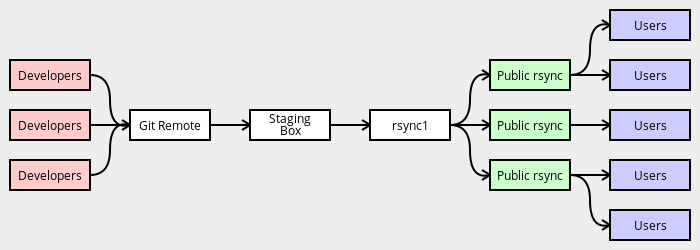

# 从 Git 到 RSYNC

对 tree 所做的更改将分阶段传播给用户：

- 开发人员修改本地 Git 克隆版本并推送到中央远程 Git 存储库。使用基于 GPG 的 Git 机制标记提交和推送。
- `Staging Box`从中央 Git 存储库同步，从 Git 历史记录生成元数据缓存、变更日志和签名的 Manifest。
- `rsync1`从`Stageing Box`同步。
- 公共同步服务器从`rsync1`同步。
- 用户从公共同步服务器同步。

每天都会从`Staging Box`中制作`emerge-websync`快照。
