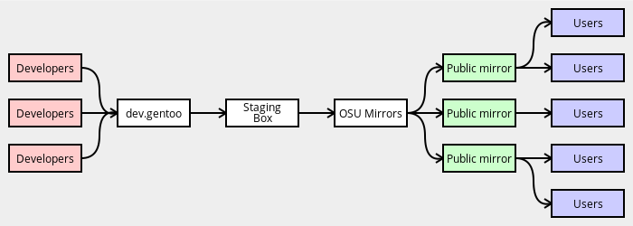

# 镜像

## 自动镜像

软件包将自动将其 `SRC_URI` 组件镜像发送到 Gentoo 镜像上，包括托管在官方 Gentoo 基础结构（即 `dev.gentoo.org` 上的开发人员空间）上的镜像。当要获得时，软件包管理器在尝试原始上游镜像之前先检查 Gentoo 镜像。

这通常是期望的行为——上游镜像易于重新排列，整理或修改文件。

## 限制自动镜像

可以使用三个`RESTRICT`关键字来控制镜像过程。

如果我们无法合法地镜像某些文件，则应使用`RESTRICT="mirror"`设置；文件仍然会从原始位置下载。

`RESTRICT="primaryuri"`设置使 Portage *首先*尝试原始位置，然后在必要时退回镜像。这不应在新的 ebuild 中使用。

还有`RESTRICT="fetch"`，它可以阻止 Portage 手动获取任何内容。如果找不到任何 `SRC_URI` 组件，则将调用[pkg_nofetch](./../ebuild-writing/ebuild-functions/pkg_nofetch.md)函数。仅在许可证要求时才应使用此选项。

## 替换自动镜像的文件

在极少数情况下，你可能需要替换已经镜像的文件。通常是上游重新制作发行包时会发生这种情况。如果有必要，请使用 `SRC_URI` 箭头符号重命名该文件。例如：

```bash
# upstream updated the distfile in place, so suffix it with _YYYYMMDD
SRC_URI="https://example.com/badupstream/${P}.tar.gz -> ${P}_20191016.tar.gz"
```

由于 Gentoo 镜像使用本地 distfile 名称进行操作，因此它们将自动获取并开始分发新版本。

请注意，如果上游进行了任何影响构建软件包的更改，则还需要修改 ebuild 的修订版。最后，请记住删除与旧 distfile 关联的 ebuild，或在 `Manifest` 中重新生成它们（如果有）的校验和 。这是必需的，因为这将导致校验和不匹配错误，因为 Manifest 文件中记录的校验和不再与提取的 distfile 的计算校验和匹配。

有关镜像内部的更多常规信息，可以在 [Infrastructure project's Distfile Mirroring System page](https://wiki.gentoo.org/wiki/Project:Infrastructure/Mirrors/Distfile_Mirroring_System)上找到。

## 合适的下载主机

如果你必须自己托管源文件（补丁程序或压缩包），只要可以自由分发（通过许可证和合法性）即可，建议你使用开发人员在`dev.gentoo.org`上的空间。由于外部覆盖可能取决于你的补丁/压缩包，因此使用 `dev.gentoo.org`上的 dev 空间可将 distfiles 保持在稳定可靠的基础结构中。如果你不再维护，其他开发人员可以接管你的 distfile 并将它们放到自己的 devspace 中。

以前的策略是直接使用`mirror://gentoo`，但是现在已弃用，因为这不允许源文件具有长期可用性和可追溯性，这可能是许可证的要求。

将文件上传到`dev.gentoo.org:~/public_html`时，必须确保该文件及其父目录可读。以这种方式引入镜像的 distfile 的示例`SRC_URI`如下：

```bash
SRC_URI="https://dev.gentoo.org/~myname/distfiles/${P}.tar.gz"
```

其中 `myname` 指开发人员的用户名。

## Gentoo 镜像

要手动将文件上传到 `mirror://gentoo`，使用`scp` 上传到 `dev.gentoo.org:/space/distfiles-local`。该文件应在四个小时内出现在镜像上（请注意，这比 [从 Git 到 RSYNC](./git-to-rsync.md) 的*频率要低*）。如果软件包的上游下载位置使用非标准的 TCP 端口（21、80 或 443 以外的任何端口），则*必须*修改相应镜像文件。否则，使用严格的防火墙可能会导致各种问题。

## 镜像流程



## 第三方镜像

[SRC_URI 变量文档](./../ebuild-writing/variables.md)介绍了第三方镜像和`mirror://`伪协议的用法
