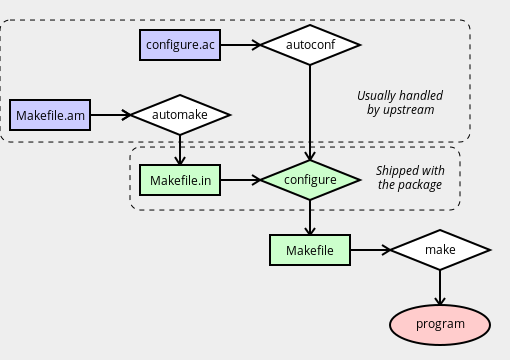

# 自动化工具基础

<div class="alert alert-note">
<b>代办事项</b>：这对 <a href="./../general-concepts/README.md">一般概念</a> 来说太长了。需要将其拆分并移动到某个地方，或者移至其自身的顶层，也可以移至<a href="./../appendices/README.md">附录</a>。
</div>

在使用 ebuild 时, 对 GNU 自动工具（`automake`, `autoconf` 等）的了解可能会很有用：

- 如果构建系统不仅仅被视为可怕的黑匣子，查找和纠正构建问题通常会更加容易。
- 自动输入文件可在确定软件包的构建时依赖性提供帮助。
- 如果可以理解构建系统文件之间的关系，那么由于在错误的时间修补错误的文件而意外破坏某些内容的风险能大大降低。

## 主要工具

Autotools 是相关软件的集合，这些软件包一起使用时，可以消除创建便携式软件时遇到的许多困难。这些工具与一些相对简单的上游提供的输入文件一起，用于为软件包创建构建系统。



在简单的设置中：

- `autoconf`程序从`configure.in`或`configure.ac`生成`configure`脚本（请参见下面的注释）。
- `automake`程序从`Makefile.am`生成一个`Makefile.in`。
- 运行`configure`脚本以从`Makefile.in`文件中生成一个或多个`Makefile`文件。
- `make`程序使用`Makefile`来编译程序。

<div class="alert alert-note">
<b>注意</b>：<code><pre>configure.in</pre></code>名称曾是以前的标准。但是，GNU文档现在建议使用<code><pre>configure.ac</pre></code>，因为在处理该程序时会更明显地使用哪个程序。这些文件具有相同的用途，并且具有相同的格式 —— 唯一的区别是名称。
</div>

你可能会发现在各个阶段功能中都使用了自动工具。 [src_prepare](./../ebuild-writing/ebuild-functions/src_prepare/README.md)函数是在配置和编译之前处理源代码的最合适的位置。特别是，在[src_configure](./../ebuild-writing/ebuild-functions/src_configure/README.md)之前调用`src_prepare`，这通常希望`configure`脚本存在。

`autoreconf` 工具可以根据需要运行 `autoconf`（以及 `automake`，`autoheader`，`aclocal`，`autopoint` 和 `libtoolize`）。有时可以如此操作。一些软件包附带了一个名为 `autogen.sh` 的 shell 脚本，该脚本执行相同的操作（这与 `autogen` *不*相关）。 autotools.eclass 包含独立工具的帮助程序函数，其名称如 `eautoconf` 和 `eautomake`。

<div class="alert alert-warning">
<b>警告</b>：在运行<code><pre>configure</pre></code>和<code><pre>make</pre></code>之间，请<b>不要</b>尝试修改任何生成的文件。这可能触发自动工具的自主功能并重新创建文件，从而导致更改被删除。在某些情况下，这还将导致<code><pre>./configure</pre></code>参数被默认删除，这可能会破坏依赖。最好的处理方法通常是改用<code><pre>.ac</pre></code>/<code><pre>.in</pre></code>文件。
</div>

## 简单使用自动工具打补丁示例

以下代码段说明了修补`Makefile.am`或`configure.ac`之后正确的处理方式：

```bash
EAPI=5

inherit autotools

src_prepare() {
	# Remove problematic LDFLAGS declaration
	sed -i -e '/^LDFLAGS/d' src/Makefile.am || die

	# Rerun autotools
	einfo "Regenerating autotools files..."
	WANT_AUTOCONF=2.5 eautoconf
	WANT_AUTOMAKE=1.9 eautomake
}

src_compile() {
	econf $(use_enable nls)
	emake
}
```

运行自动工具之前的`einfo`消息不是必需的。但是，这些步骤有时可能需要执行一段时间，并且中途可能不会产生任何输出信息，因此让用户知道某些事情仍在发生可能是有意义的。请参阅[消息](./../ebuild-writing/messages.md)。

## `configure.ac` 文件

`configure.ac` 文件用于创建`./configure` 脚本。它由一系列宏组成，这些宏由`autoconf`进行处理和扩展 。这些宏可以检查软件包和库，处理`--enable` 和 `--with` 参数，并生成各种文件。

## `configure.ac`基本格式

`configure.ac` 文件是基本的文本文件。缩进和空格基本上无关紧要。注释由字符串`dnl`表示 （`dnl` 实际上是一个宏，它会丢弃其余部分输入，它代表“放弃新行”）。

如果上述概念让你感到困难，你可能应该停止阅读此页。因为情况可能会变得更糟。

典型的文件可能以以下内容开头：

```bash
dnl Process this file with autoconf
AC_INIT(appname, 0.1)
AC_PREREQ(2.5)
AC_CONFIG_SRCDIR(src/main.c)
AC_CONFIG_AUX_DIR(config)
AM_INIT_AUTOMAKE(1.8)
```

`AC_PREREQ` 行（如果存在）告诉 `autoconf` 所需版本。这很有用，因为 `autoconf` 版本之间不兼容。在上面的示例中，我们需要`=autoconf-2.5*`。并且需要在调用`autoconf`时 `export WANT_AUTOCONF="2.5"`（或使用 `autoconf-2.59` 脚本） 。

`AM_INIT_AUTOMAKE` 行告诉 `automake` 所需版本。同样，`automake-1.7` 脚本与`automake-1.8`一起正常工作的可能性很小。环境中设置`WANT_AUTOMAKE="1.8"`可用于使未版本化的 `automake` 调用运行正确的版本。

<div class="alert alert-note">
<b>注意</b>： 这些<code><pre>WANT_</pre></code>变量是Gentoo函数，最初来自Mandrake。其他发行版可能处理不同的事情。
</div>

通常，将进行一些标准检查：

```bash
dnl Check for toolchain and install components
AC_PROG_CC
AC_PROG_INSTALL
AC_PROG_LN_S
AC_PROG_RANLIB
```

对于非标准应用程序，你可能还会看到手动检查：

```bash
dnl Check for sed
AC_CHECK_PROGS(regex_cmd, sed)
if test x$regex_cmd = "x" ; then
    AC_MSG_ERROR([sed is required to build the data files.])
fi
```

你可能还会看到对编译器函数的检查：

```bash
dnl Check that our compiler can do const and inline
AC_C_CONST
AC_C_INLINE
```

库和头文件检查：

```bash
dnl Check for standard headers:
AC_HEADER_STDC
AC_HEADER_DIRENT
AC_CHECK_HEADERS([stdlib.h stdio.h libintl.h locale.h])

dnl Check for libraries:
AC_CHECK_LIB(ssl, SSL_free)
```

函数检查：

```bash
dnl Check for functions:
AC_CHECK_FUNCS([setlocale strtol])
```

通常，这些内容会混杂在一起而没有任何有用的注释。在某些情况下，所涉及的应用程序甚至不需要进行许多检查 —— 大多数自动工具代码是复制/粘贴的，而不是从头开始编写的，并且 `autoscan`（一种有助于编写`configure.ac`代码的工具 ）有时急于望添加检查。

该文件将完成一些输出函数：

```bash
AM_CONFIG_HEADER(config.h)
AC_OUTPUT(Makefile src/Makefile nls/Makefile man/Makefile tests/Makefile)
```

这些用于使`./configure`脚本生成相关文件。

## 启用和禁用检查

到目前为止，我们只看到了“硬”依赖。许多软件包有对各种附加函数的*可选*支持（图形工具包，添加函数的库，解释器，特性等）。（如果幸运的话）可以通过`--enable-foo` 和`--disable-foo` 切换为`./configure`处理。这些是根据 `autoconf` 规则生成的。

一个简单的`--enable`/`--disable` 函数可能类似于以下内容：

```bash
AC_MSG_CHECKING(--enable-cscope argument)
AC_ARG_ENABLE(cscope,
    [  --enable-cscope         Include cscope interface.],
    [enable_cscope=$enableval],
    [enable_cscope="no"])
AC_MSG_RESULT($enable_cscope)
if test "$enable_cscope" = "yes"; then
  AC_DEFINE(FEAT_CSCOPE)
fi
```

有时会根据是否启用选项来进行更复杂的检查。还有一些预定义的宏，其中包括 `AC_ARG_ENABLE`。所以从`configure.ac`中 查找`AC_ARG_ENABLE` 可能无法给出一个完整列表。更好的方法是使用`./configure --help`并检查输出。

<div class="alert alert-important">
<b>重要提示</b>： 当提供了对<code><pre>./configure</pre></code>的<code><pre>--enable</pre></code>或-<code><pre>-disable</pre></code>开关时，将使用第三个参数，而当未通过此类开关时，将使用第四个参数。一个常见的误解是第三个是启用，第四个是禁用 —— 事实<b>并非</b>如此。你可能会遇到错误的软件包。
</div>

检查软件包是否正确使用了此宏的一种简单方法是安装可选依赖项，然后尝试全部`./configure`。 `./configure --enable-foo` 和`./configure --disable-foo`。如果第二次和第三次试验得出相同的结果，则说明存在问题。如果第一轮对第二次和第三次给出不同的结果，则很可能是对 `AC_ARG_ENABLE` 论点的误用。

## 检查/不检查

一个简单的`--with`/`--without`检查可能看起来像：

```bash
AC_MSG_CHECKING([whether to enable foo])
AC_ARG_WITH(foo,
    [  --with-foo           enable foo support],
    with_foo=$withval,
    with_foo=yes)
AC_MSG_RESULT($with_foo)
```

同样，第三个参数用于“指定”，第四个参数用于“未指定”，并且有包含 `with` 选项的标准宏。

## 自动检查

可以编写绕过手动启用/禁用约定的 `autoconf` 规则（或者忽略用户的要求）。如果你的软件包这样做，则必须对其进行修复以避免依赖关系问题。

最常见的形式是软件包，它们仅用于 `AC_CHECK_LIB` 决定是否启用特定功能。如果找到执行此操作的软件包，则**必须**更改其行为。

## `configure.ac`引号规则

在后台，`autoconf` 大量使用 `m4` 宏处理器来完成工作。`autoconf`将`m4`引号字符设置为`[`和`]`，分别用于打开和关闭引号。使用`"`或`'`可能会产生意外的结果。

要包括一个文字左方括号，最简单的方法是使用特殊字符串`@<:@`。对于右括号，请使用`@:>@`。

例如：

```bash
AC_MSG_RESULT(the first)
AC_MSG_RESULT([the second])
AC_MSG_RESULT("the third")
AC_MSG_RESULT(@<:@the fourth@:>@)
AC_MSG_RESULT([@<:@the fifth@:>@])
```

输出：

```bash
    the first
    the second
    "the third"
    [the fourth]
    [the fifth]
```

如有疑问，通常最安全的做法是使用宏`[ ]`引号而不是不加引号。

## `Makefile.am` 文件

`Makefile.am`文件由`automake`处理，以创`建Makefile.in`，而后者又由`configure`处理以创建`Makefile`，由`make`使用该文件来构建软件。

基本格式类似于`Makefile`的格式 。但是，你将看到设置了各种“特殊”变量，而不是手动编写每个规则。

一个非常简单的例子：

```bash
bin_PROGRAMS = myapp
myapp_SOURCES = myapp_commandline.c myapp.c
```

所有标准 GNU 规则都会生成，因此 `make`。`make clean`。 `make distclean`。`make dist` 等等都可以在这里工作。

每当没有标准的`automake`方式来处理特定任务时，你可能还会看到一些标准的`Makefile`构造。例如：

```bash
CLEANFILES = glep31check.1
man_MANS = glep31check.1
EXTRA_DIST = glep31check.in

%.1 : %.in
    @regex_cmd@ -e "s,\@VERSION\@,$(VERSION),g" $? > $@
```

在这里，在创建`Makefile`时，`@regex_cmd@`变量将被`configure`所检测到的任何内容（在本例中为`sed`）替换。这是通过`configure.ac`中的宏`AC_SUBST(VARNAME)`处理的。

## Makefile 变量

有时，行为不佳的 `Makefile.am` 文件会覆盖诸如`CFLAGS`的用户变量 。一定不允许这样做 —— 请参阅[不过滤变量](./user-environment.md)。在这些情况下，应使用单独的特殊变量 —— 设置 `CFLAGS`。例如，`Makefile.am` 应使用`AM_CFLAGS` 以便忽略用户首选项。

因此，使用`Makefile.am`时：

```bash
CFLAGS="-Wall"
```

使用`sed` 或 `patch `时：

```bash
AM_CFLAGS="-Wall"
```

请记住，手动运行 `autoconf`，然后 再运行`automake`。

## `config.h.in` 文件

`config.h.in` 文件由`autoheader`生成 。你通常不必为此担心，但是如果上游没有交付预生成的版本，则有时可能需要在构建过程中手动运行`autoheader` 。

## `aclocal` 和 `m4` 文件

在 `configure.ac` 或 `configure.in` 文件中，你不仅可以调用由 `autoconf` 和 `automake` 定义的默认宏。还能调用其他可以由特定软件包定义的函数，例如库和程序，以正确的方式检查其功能。

这些函数（通常）由软件包放在`/usr/share/aclocal` 目录中的 `m4` 文件定义。当你需要重新生成自动工具文件时，可能会出现问题，因为 `configure.ac` 文件所使用的功能可以在用户系统上未安装的 `m4` 宏文件中定义。例如，某些需要库且被 `USE` 标志禁用的可选功能就是这种情况。如果未在用户系统中安装 `m4` 文件，则 `autoconf` 步骤将失败。

为了解决这个问题，大多数软件包只是将它们的 `configure.ac` 所需的 `m4` 宏文件放在源软件包的 `m4` 子目录中。不幸的是，很多`m4` 目录并不是完整的。

在这些情况下，你需要找出 `m4` 文件，该文件通常由依赖项安装在`/usr/share/ aclocal` 中。并确保 `src_unpack` 阶段既可以将这些文件提供给自动工具，也可以调用 `aclocal` 来重新创建 `aclocal.m4` 文件，该文件将由 `autoconf` 在创建配置脚本时使用。

通常，它缺少多个 `m4` 文件，因此你可能希望将它们打包成压缩包 中，然后将其添加到 `SRC_URI` 中。确保将压缩包提取到`${WORKDIR}`中某个位置（例如，在 `gentoo-m4` 目录中）后，通常可以使用两种通用方法来处理这些宏文件，一种用于不完整 `m4` 目录附带的软件包，另一种用于不带 `m4` 目录的软件包。

在第一种情况下，你通常希望执行以下操作：

```bash
einfo "Regenerating autotools files..."
cp "${WORKDIR}/gentoo-m4" "${S}/m4" || die "m4 copy failed"
WANT_AUTOCONF="2.5" aclocal -I "${S}/m4" || die "aclocal failed"
WANT_AUTOCONF="2.5" autoconf || die "autoconf failed"
```

在第二种情况下，你可以通过以下方式简化它：

```bash
einfo "Regenerating autotools files..."
WANT_AUTOCONF="2.5" aclocal -I "${WORKDIR}/gentoo-m4" || die "aclocal failed"
WANT_AUTOCONF="2.5" autoconf || die "autoconf failed"
```

无需复制文件。

当 `m4` 分发中缺少所需文件时，最好通知上游，请他们在源压缩包中添加所有所需文件，以防宏更改时版本冲突。

## Libtool

<div class="alert alert-note">
<b>代办事项</b>：有关 libtool，libtoolize，elibtoolize，libtool.eclass 的资料。我对此几乎一无所知...是的！
</div>

## 进一步的自动工具阅读

有关自动工具的更多详细信息：

- Gary V. Vaughan，Ben Elliston，Tom Tromey 和 Ian Lance Taylor（通常称为“The Autobook”）一书《GNU Autoconf，Automake 和 Libtool》提供了一个很好的但有些过时的描述。[网络免费版](https://sourceware.org/autobook/)。
- 各种自动工具组件的 GNU 文档质量和完整性各不相同：
  - [GNU automake 手册](https://www.gnu.org/software/automake/manual/automake.html)
  - [GNU autoconf 手册](https://www.gnu.org/software/autoconf/manual/)
  - [GNU libtool 手册](https://www.gnu.org/software/libtool/manual/)
  - [GNU m4 手册](https://www.gnu.org/software/m4/manual/m4.html)
  - [自动工具神话破坏者](https://autotools.io/)
- 网络上有一些不错的概述讲座。 [这些幻灯片](https://www.shlomifish.org/lecture/Autotools/)就是一个例子。
